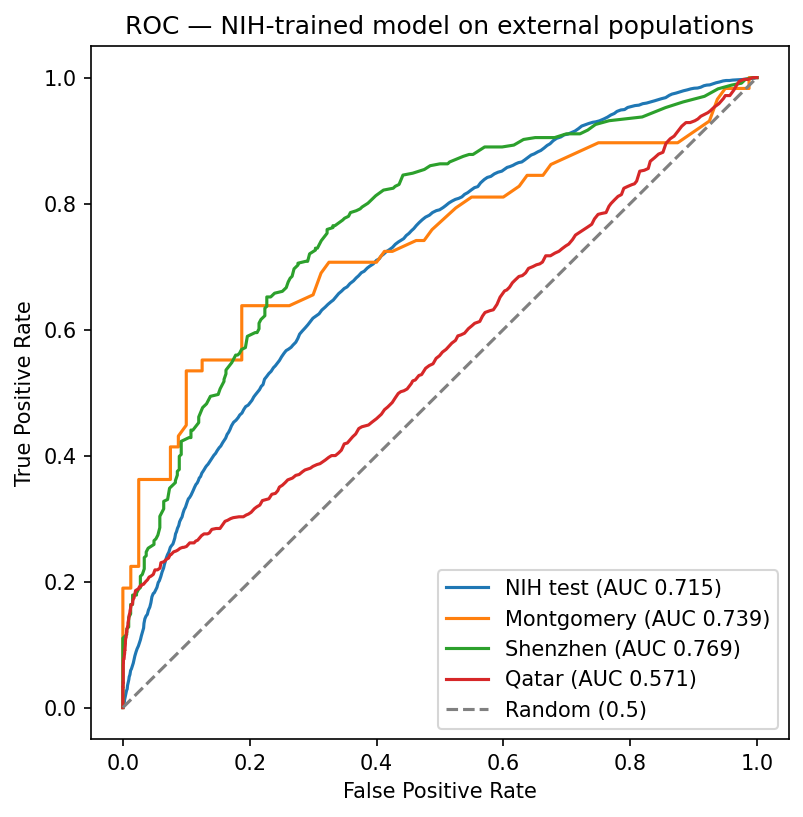
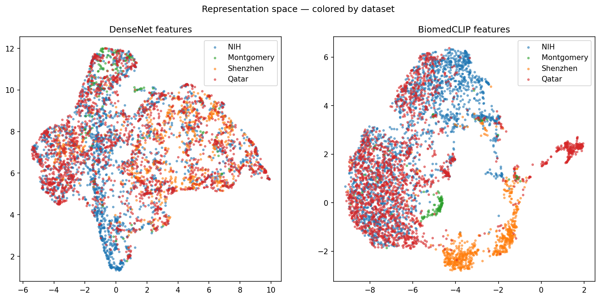

# Cross-Population Generalization of Proxy-Trained Chest X-Ray Models for Tuberculosis

*A specialist fails on the target MENA population where a zero-shot foundation model succeeds*

**Author:** Adem Sahli · **Affiliation:** Higher Institute of Computer Science (ISI), Tunisia · **ORCID:** 0009-0003-0749-0575
**Keywords:** tuberculosis screening · chest radiography · cross-population generalization · shortcut learning · foundation models · Grad-CAM

*Preprint prepared for medRxiv; target venue: MICCAI DALI Workshop 2026.*

---

## Abstract

Tuberculosis remains a leading cause of death, and automated chest radiography screening is a promising tool for high-burden and underserved regions, including the Middle East and North Africa (MENA). Whether such models generalize across populations is largely untested. We trained a DenseNet-121 on NIH ChestX-ray14 using the Infiltration finding as a proxy for tuberculosis and evaluated the frozen model on three external datasets: Montgomery (USA), Shenzhen (China), and a MENA dataset from Qatar. The model transferred unevenly, matching or beating its home score on Shenzhen (AUC 0.769 vs 0.715) but collapsing to near chance on Qatar (AUC 0.571, confidence interval disjoint from all others), and at the WHO-recommended sensitivity of 0.90, specificity was unusably low on every dataset (0.11–0.38).

We probed the mechanism of this failure. Grad-CAM revealed the specialist's decisions rest on a stereotyped right-upper-lung spatial prior whose attention collapses to image background on errors, and UMAP showed the target population is *not* out-of-distribution in feature space, indicating a decision-process artifact rather than distribution shift. Consistent with this, a zero-shot foundation model (BiomedCLIP) succeeded on the same Qatar images (AUC 0.838, artifact-controlled) with +0.267 over the fine-tuned specialist. We conclude that cross-population failure in proxy-trained TB models is consistent with shortcut-like decision processes, and that shortcut-robust foundation-model representations offer a promising path toward population-invariant TB screening.

---

## Introduction

Tuberculosis remains one of the world's deadliest infectious diseases. In 2024, the WHO estimated 10.7 million new cases and 1.23 million deaths, with the largest burden concentrated in low- and middle-income regions (WHO, 2025). The Middle East and North Africa (MENA) is increasingly recognized as a region of concern, where case detection gaps and rising drug resistance make reliable screening a priority (WHO EMRO, 2025). Chest radiography is a first-line screening tool, and deep learning has raised the prospect of automated, low-cost TB screening in exactly these resource-constrained settings.

Yet a fundamental question remains largely unanswered: **do chest X-ray models generalize across populations?** Most deep-learning TB systems are trained and evaluated on a single population, frequently the one that produced the training data. When such a model is deployed on a different population, different scanner, different acquisition protocol, different disease presentation, and different demographic makeup, its performance is not guaranteed to transfer. For a screening tool aimed at populations unlike its training cohort, this uncertainty is not a technical detail; it is a safety and deployment concern.

We investigate this question through a **controlled cross-population evaluation** of a tuberculosis model. We train a single DenseNet-121 on the NIH ChestX-ray14 dataset using the Infiltration finding as a proxy label for tuberculosis, then evaluate the *frozen* model on three external datasets: Montgomery (USA), Shenzhen (China), and a MENA dataset from Qatar. We further ask *why* the model succeeds or fails, using Grad-CAM interpretability and representation-space analysis, and we compare the specialist against a large zero-shot foundation model (BiomedCLIP).

Our central finding is that the model's failure on the target MENA population is **not attributable to simple distribution shift**: its decision process appears to rely on a coarse, shortcut-like spatial prior, and a zero-shot foundation model that lacks that prior succeeds on the same images. These results suggest that cross-population generalization for TB screening is governed less by whether the data is "in distribution" and more by *how the model decides*, and that foundation-model representations, free of proxy-label shortcuts, offer a promising path toward deployable, population-invariant TB screening.

### Contributions
- A controlled cross-population evaluation of a proxy-trained TB model on three external populations, including a MENA cohort (Table 1), with statistical significance and WHO-operating-point analysis.
- An interpretability and representation analysis showing the failure is decision-process-mediated (stereotyped spatial prior; attention collapse on errors; no representation-space separation).
- A head-to-head zero-shot foundation-model comparison in which BiomedCLIP beats the fine-tuned specialist on the target population by +0.267 AUC, artifact-controlled.

## Related Work

### AI for tuberculosis screening from chest radiographs
Deep learning has repeatedly been shown to detect chest X-ray abnormalities at radiologist-competitive levels (Rajpurkar et al., 2017; Irvin et al., 2019; Wang et al., 2017). For tuberculosis specifically, several systems report high accuracy on single-population cohorts and are promoted for screening in high-burden settings (Murphy et al., 2020). A recurrent methodological caveat is that many of these systems are trained and evaluated on the *same* population, leaving cross-population generalization, the property that matters for deployment, largely untested (Rajpurkar et al., 2020).

### Cross-population generalization and distribution shift in medical imaging
Medical imaging models are known to degrade under distribution shift, differences in scanner, acquisition protocol, population demographics, and disease presentation between training and deployment cohorts (Su et al., 2024). A common finding is that models trained on one institution's data underperform on others', with performance drops that are difficult to predict a priori (Rajpurkar et al., 2020). We add a MENA-targeted cross-population evaluation and probe the *mechanism* of failure rather than reporting accuracy degradation alone.

### Shortcut learning and dataset bias
Deep classifiers frequently rely on spurious correlations, "shortcuts", rather than the medically meaningful signal: patient-position laterality markers, scan overlays, or acquisition-specific color and texture biases (Geirhos et al., 2020; Zech et al., 2018). Such shortcuts inflate within-distribution accuracy and silently break under shift (Geirhos et al., 2020). Our Grad-CAM and representation analyses ask whether the observed cross-population failure is a consequence of shortcut-dependent decision processes rather than data being out-of-distribution.

### Foundation models and zero-shot transfer for medical imaging
Contrastive image-text foundation models pretrained on large biomedical corpora (BiomedCLIP, ~15M image-text pairs) transfer to downstream tasks with little or no task-specific training (Zhang et al., 2023). A key open question is whether such generalist models generalize across populations better than task-specialists fine-tuned on proxy-labeled data; we address this directly below.

## Methods

### 2.1 Datasets

**Training set, NIH ChestX-ray14.** We trained on the NIH ChestX-ray14 dataset (112,120 frontal chest radiographs) using the *Infiltration* finding as a proxy label for tuberculosis, following the CheXNet protocol. Because NIH provides no TB-specific labels, we defined the positive class as images whose multi-label finding vector contained *Infiltration* and the negative class as images labeled *No Finding*. Images with other finding combinations were excluded, yielding 19,870 positive and 60,412 negative images (ratio ≈ 1:3.0). Images were resized to 224×224 pixels (the 224-resolution release).

**External test sets.** Three publicly available TB datasets were used for zero-shot external evaluation, none of which was used for training:

- **Montgomery** (USA; n = 138; 80 normal / 58 TB), from the Montgomery County Department of Health and Human Services.
- **Shenzhen** (China; n = 662; 326 normal / 336 TB), from the Shenzhen No. 3 People's Hospital.
- **Qatar TB** (MENA; n = 4,200; 3,500 normal / 700 TB), assembled at Hamad Medical Corporation (Doha, Qatar), used here as a MENA-population proxy. This dataset carries a known acquisition artifact: a portion of the tuberculosis subset is colorized while the normal subset is uniformly grayscale. As detailed below, we evaluate on this set with color cues removed.

External dataset labels were encoded either in the filename suffix (Montgomery/Shenzhen: `_0` = normal, `_1` = TB) or in the directory structure (Qatar: `Normal/` vs `Tuberculosis/`). We generated per-dataset label manifests (CSV) from these encodings and verified the resulting class counts against the published dataset sizes before evaluation.

### 2.2 Preprocessing

All images were converted to grayscale and resized to 224×224. For the DenseNet input we replicated the grayscale channel to three channels and applied the ImageNet normalization (mean = [0.485, 0.456, 0.406], std = [0.229, 0.224, 0.225]). During training only, a random horizontal flip was applied; the external-evaluation transform contained no augmentation and was identical to the training-set evaluation transform, ensuring a fair comparison across populations.

### 2.3 Model and training

**Architecture.** We fine-tuned a DenseNet-121 initialized with ImageNet weights; the classification head was replaced with a single linear unit producing a logit for the Infiltration proxy (BCE). All ~7.0M parameters were trainable (full fine-tune).

**Training protocol.** NIH images were split **patient-wise** (70/15/15) by stratified assignment of unique patient identifiers, preventing patient leakage between train, development, and test. Training minimized binary-cross-entropy-with-logits with class re-weighting (`pos_weight = n_neg/n_pos ≈ 3.04`) to counter the ~1:3 imbalance, using AdamW (lr = 1e-4, weight decay = 1e-4), a cosine annealing schedule (T_max = 25), gradient clipping (max norm = 1.0), and early stopping (patience = 6 epochs) by development-set AUC. The best checkpoint by development AUC was retained. Seeds were fixed across Python, NumPy, and torch RNGs for reproducibility.

### 2.4 Evaluation

**Frozen inference.** The trained model was evaluated in `eval()` mode with gradients disabled on the held-out NIH test split and on each external dataset. Per image we recorded the sigmoid probability of the positive class.

**Metrics.** For each dataset we computed the area under the ROC curve (AUC) using a pure-PyTorch rank computation, and precision, recall, and F1 at a 0.5 threshold. 95% confidence intervals (CIs) for AUC were obtained by bootstrap resampling (n = 200 replicates; the pair-count method made larger replicates expensive on CPU).

**WHO operating-point analysis.** Because tuberculosis screening tools are required to achieve high sensitivity, we determined, for each dataset, the highest decision threshold at which sensitivity ≥ 0.90 and report the corresponding specificity and precision. This mirrors the WHO-recommended screening sensitivity target and is the clinically meaningful operating point.

**Statistical significance.** Differences between dataset AUCs were assessed via bootstrap confidence intervals on the AUC difference (AUC_NIH − AUC_external); a difference was deemed significant when its 95% CI excluded zero.

### 2.5 Interpretability, Grad-CAM

To examine which image regions drove the model's decisions, we computed gradient-weighted class activation maps (Grad-CAM; Selvaraju et al., 2017) from the final convolutional feature map of the DenseNet (7×7). For each of Montgomery and Shenzhen we selected 10 true positives and 10 false negatives (at threshold 0.5). Heatmaps were upsampled to 224×224, rectified, min-max normalized, and blended at 50% opacity over the input. For a subset of false negatives we additionally inspected raw (un-normalized) activation magnitudes to rule out rescaling artifacts. The backward hook was registered on the output tensor to avoid the in-place-ReLU autograd conflict in DenseNet.

### 2.6 Foundation-model comparison

We compared the fine-tuned specialist against a large biomedical foundation model, BiomedCLIP (400M parameters; pretrained on ~15M biomedical image-text pairs), used **zero-shot**: images were scored by cosine similarity between the image embedding and the text prompts "a chest x-ray showing infiltration" and "a chest x-ray showing no abnormality", followed by a softmax over the two prompts. AUC was computed from the infiltration-prompt probability. Because the Qatar dataset contains a color acquisition artifact and BiomedCLIP accepts RGB input, we additionally re-evaluated Qatar with color cues removed (grayscale input), so the foundation-model comparison controls for the same artifact neutralized in the DenseNet pipeline.

### 2.7 Implementation

Experiments were run in PyTorch on NVIDIA T4 GPU. External datasets were obtained from their public repositories; the model, data-processing, and evaluation code is available in the project repository. All AUC, threshold, and significance computations were implemented in pure PyTorch without reliance on scikit-learn.

## Results

### 3.1 Home held-out performance

The fine-tuned DenseNet achieved a test AUC of **0.715** (95% CI [0.707, 0.725]) on the held-out NIH test split (n = 17,260; 3,016 positives / 14,244 negatives), with precision 0.313, recall 0.574, and F1 0.405 at a 0.5 threshold. This is consistent with prior reports for the Infiltration-vs-No-Finding proxy (Wang et al. ~0.66; CheXNet 0.7345).

### 3.2 Cross-population external evaluation (Table 1)

Evaluated frozen on the three external datasets, the model transferred **unevenly**:

**Table 1.** Cross-population external evaluation of the NIH-trained DenseNet-121, evaluated frozen (no fine-tuning) on the held-out NIH test split and three external datasets. AUC = area under the ROC curve; CI = 95% bootstrap confidence interval (n = 200 replicates); P/R/F1 = precision/recall/F1 at a fixed 0.5 threshold; WHO thr/sens/spec = decision threshold, sensitivity, and specificity at the WHO-recommended screening operating point (sensitivity ≥ 0.90).

| Dataset | n | AUC | 95% CI | P@0.5 | R@0.5 | F1@0.5 | WHO thr | WHO sens | WHO spec |
|---|---|---|---|---|---|---|---|---|---|
| NIH (home) | 17,260 | 0.715 | [0.707, 0.725] | 0.313 | 0.574 | 0.405 | 0.203 | 0.900 | 0.320 |
| Montgomery | 138 | 0.739 | [0.650, 0.813] | 0.917 | 0.190 | 0.314 | 0.065 | 0.914 | 0.112 |
| Shenzhen | 662 | 0.769 | [0.734, 0.802] | 0.882 | 0.199 | 0.325 | 0.073 | 0.902 | 0.383 |
| Qatar (MENA) | 4,200 | 0.571 | [0.546, 0.594] | 0.230 | 0.319 | 0.267 | 0.088 | 0.903 | 0.139 |

**Two striking patterns emerge.**

First, on two of the three external populations the model performed **at or above its home score**: Shenzhen (AUC 0.769) was significantly higher than NIH (bootstrap difference CI [−0.093, −0.020], i.e. NIH − Shenzhen < 0), and Montgomery (0.739) was comparable but noisier given its small size (CI crosses zero). That a model trained on NLP-derived proxy labels generalizes to *real* TB cases on two populations, despite different scanners, populations, and countries, is a positive-transfer result.

Second, the model **failed on the MENA dataset**: Qatar AUC was 0.571, near chance and statistically well below every other dataset (vs NIH, difference CI [+0.116, +0.170]). The Qatar confidence interval [0.546, 0.594] is fully disjoint from all others.

**WHO-operability failure.** At the WHO-recommended screening sensitivity (≥ 0.90), specificity collapsed on **every** dataset, including the home set: 0.320 (NIH), 0.112 (Montgomery), 0.383 (Shenzhen), and 0.139 (Qatar). The thresholds required to reach 90% sensitivity were very low (0.065–0.203), meaning the model effectively labels any image with measurable signal as positive. No dataset could be screened at WHO sensitivity without referring roughly 62–89% of healthy patients.

**Figure 1.** ROC curves for the NIH-trained DenseNet-121 on the held-out NIH test split and the three external datasets (AUC values as in Table 1); the diagonal line marks chance performance (AUC = 0.5).

### 3.3 What the model attends to (Grad-CAM)

Grad-CAM on true positives from both external datasets showed attention concentrated **within the lung parenchyma**, with no reliance on corner markers, laterality text, or image borders, ruling out the most blatant burned-in-annotation shortcut. However, the highlighted region was **stereotyped**: near-identical size, shape, and right-upper/mid-lung position across patients. Right-upper-lobe involvement is the most common presentation of post-primary TB, so this pattern is consistent with a coarse, epidemiologically plausible spatial prior, but not with lesion-specific localization, since the fixed geometry across patients suggests the model weights a lung region rather than detecting discrete pathology.

False negatives exhibited **two distinct failure mechanisms**: (i) attention collapsing *outside* the lungs (most often a horizontal bottom-border band, and in some cases a shoulder hotspot), and (ii) lung-region activation that was present and anatomically plausible but too weak to cross the 0.5 threshold (borderline-confidence failure). Raw (un-normalized) activation magnitudes confirmed that the border response was genuine rather than a min-max rescaling artifact; a modest border response (≈ 8–11% of peak activation) was present in all false negatives examined and became dominant when lung evidence was weak.

**Figure 2.** Grad-CAM overlays for the NIH-trained specialist on Montgomery and Shenzhen true positives and false negatives (10 images per panel, threshold 0.5; heatmaps min-max normalized and blended at 50% opacity over the input). A minority of false negatives (e.g., Montgomery #9, Shenzhen #2) exhibit no positive activation at all, raw activation magnitudes confirmed these cases are genuine near-zero maps rather than rendering artifacts, consistent with an absence of learned evidence for these images.

### 3.4 A zero-shot foundation model succeeds where the specialist fails (Table 2)

Using BiomedCLIP zero-shot (no training, text-prompt scoring), we compared the foundation model against the fine-tuned specialist:

**Table 2.** Zero-shot BiomedCLIP versus the fine-tuned DenseNet-121 specialist across all four evaluation sets. Qatar's BiomedCLIP AUC (0.838) uses color-neutralized (grayscale) input to control for a known acquisition artifact in the Qatar dataset's tuberculosis subset (§2.6, §4.4); the same images scored with the original RGB input give AUC 0.849 (Δ = 0.011), reported in the text below as a robustness check, not as the headline number.

| Dataset | DenseNet (fine-tuned) | BiomedCLIP (zero-shot) |
|---|---|---|
| NIH | 0.715 | 0.633 |
| Montgomery | 0.739 | **0.850** |
| Shenzhen | **0.769** | 0.650 |
| Qatar (MENA) | 0.571 | **0.838** (color-neutralized) |

The result is striking and **artifact-controlled**: on the target MENA population, a foundation model with zero training achieved AUC **0.838**, a +0.267 gain over the fine-tuned specialist, and this held after color cues were removed from the Qatar input (0.838 vs 0.849 with color, Δ = 0.011). No single model wins everywhere (the specialist retains NIH and Shenzhen), but **on the population of clinical interest, the generalist wins decisively.** This comparison is diagnostic rather than a model-quality contest: because the specialist beats the generalist in-distribution (NIH) and on Shenzhen, the Qatar result isolates a population-specific failure of the specialist rather than a general quality gap. The generalist's zero-shot success on the same images indicates that the discriminative signal is present in the Qatar data but unused by the specialist's decision process.

### 3.5 Representation geometry (UMAP)

UMAP projections of the DenseNet features colored by dataset formed a single continuous manifold with no hard boundaries; **Qatar was not an island** but overlapped extensively with NIH. The same overlap held in BiomedCLIP feature space, where Montgomery and Shenzhen formed distinct sub-clusters. This indicates the Qatar failure is **not** attributable to gross out-of-distribution separation of the data, consistent with a decision-process explanation rather than a representation-space one.

**Figure 3.** UMAP projections of 1,024-dimensional image embeddings from the trained DenseNet-121 (left) and zero-shot BiomedCLIP (right), colored by source dataset. Qatar overlaps extensively with NIH in both representation spaces, while Montgomery and Shenzhen form more distinct sub-clusters under BiomedCLIP; cluster overlap and separation are descriptive of local embedding structure only and are not evaluated quantitatively.

## Discussion

### 4.1 The failure is consistent with a decision-process artifact, not distribution shift

The central question we set out to answer was whether a proxy-trained TB model generalizes across populations. The answer is more subtle than a simple "yes" or "no", and the evidence points to a specific mechanism.

Our UMAP analysis shows that **Qatar is not out-of-distribution in feature space**: its embeddings overlap extensively with NIH in both the DenseNet and BiomedCLIP representation spaces. If the Qatar failure were driven by the data being foreign, we would expect separation; we observe overlap. Yet the specialist still fails (AUC 0.571), while a zero-shot foundation model succeeds on the same images (AUC 0.838). The signal is present in the data; the specialist's decision process cannot exploit it.

Grad-CAM explains why. The specialist's true-positive decisions rest on a **stereotyped right-upper-lung spatial prior**, a near-identical activation blob across patients, plausibly echoing the epidemiological predominance of right-upper-lobe TB, but not lesion-specific. When that prior is not satisfied, attention **collapses to non-anatomical regions** (image borders), rather than searching elsewhere in the chest. This is the signature of a shortcut-dependent classifier: it has learned *where* to look, not *what* to look for. A model whose decisions depend on such a prior is fragile to exactly the acquisition and presentation differences that characterize a new population.

Taken together, these results support the interpretation that **the observed cross-population failure is consistent with a decision-process artifact**, a consequence of shortcut-like spatial priors learned from proxy-labeled training data, rather than a distribution-shift property of the target data. We are deliberately careful to frame this as a well-supported hypothesis, not a mechanistic proof: Grad-CAM shows where the model looks, and the representation and zero-shot results are consistent with a decision-side explanation.

The specialist's positive transfer to real TB populations is as important as its failure. A model trained on an NLP-derived proxy label generalized to real, independently collected TB cases on other continents (Shenzhen AUC 0.769 significantly above NIH; Montgomery 0.739 comparable). This is the positive control that makes the Qatar failure interpretable: had the specialist failed everywhere, Qatar would be unremarkable. That the same model matches or beats a generalist in-distribution and on Shenzhen, yet collapses on Qatar, is what isolates the failure as population-specific rather than a global quality gap.

### 4.2 Why the foundation model succeeds

BiomedCLIP, a 400M-parameter model pretrained on ~15M biomedical image-text pairs, achieved a higher AUC on Qatar (0.838, color-neutralized) with zero training than the fine-tuned specialist (0.571), a +0.267 gain that held after controlling for the known color artifact. This is consistent with pretraining *representational diversity*: features learned across many imaging contexts and modalities are more population-invariant and less entangled with task-specific shortcuts than features fine-tuned on a single proxy-labeled dataset.

We note that no single model wins everywhere: the specialist retained the edge on its home distribution (NIH) and on Shenzhen, while the generalist dominated Montgomery and Qatar. This "no single model wins" pattern argues against a naive "foundation models are always better" reading and in favor of a more useful conclusion: **for cross-population screening, representation diversity and shortcut-robustness matter more than proxy-label fine-tuning.** The comparison is diagnostic rather than a model-quality contest: because the specialist retains the edge on NIH and Shenzhen, the Qatar result isolates a population-specific failure rather than a general quality gap, and the generalist's zero-shot success indicates the discriminative signal is present in the Qatar data but unused by the specialist's decision process.

### 4.3 Clinical implications

At the WHO-recommended sensitivity of 0.90, specificity collapsed on every dataset (0.11–0.38), including the home set. Operationally, this means the specialist, and, by extension, models of this class, cannot serve as a standalone TB screener without overwhelming referral volumes, even on the population it was trained on. Screening deployment therefore requires either substantially more discriminative models, explicit operating-point selection with human-in-the-loop triage, or a recalibration strategy on target-population data.

### 4.4 Limitations

We are explicit about the limitations of this study:
- **Proxy labels.** NIH provides no TB labels; the Infiltration proxy is correlated with, but not identical to, true TB. Positive-transfer to real TB datasets (Montgomery/Shenzhen) partially validates the proxy, but the training signal is not a confirmed diagnosis.
- **Small external sets.** Montgomery (n = 138) yields wide confidence intervals; its AUC is consistent with NIH but not distinguishable from it.
- **Qatar acquisition artifact.** The Qatar dataset contains a colorized subset in its TB class. We evaluate it with color cues removed; the color-neutralized number (0.838) is reported for the foundation model and the specialist pipeline is grayscale by construction. The artifact limits the strength of Qatar-only conclusions and motivates the follow-up subgroup analysis.
- **Single specialist vs single generalist.** We compare one fine-tuned DenseNet with one foundation model; both are single instances. The mechanism hypothesis (shortcut-mediated failure) should be tested across architectures.
- **No clinical validation.** These are offline AUC/operating-point analyses, not prospective screening evaluations.

### 4.5 Future work

Our findings motivate a direct causal test of the shortcut hypothesis: measuring whether shortcut reliance predicts adaptation difficulty, and whether shortcut-robust (or foundation-model) representations eliminate the cross-population gap. We also plan to examine the minority-Qatar subgroup that forms an isolated cluster in BiomedCLIP space, and to validate on additional MENA populations.

## Conclusion

We evaluated a proxy-trained tuberculosis model across three external populations and found that its failure on the target MENA cohort is **consistent with a decision-process artifact rather than a distribution-shift property of the data**. Grad-CAM revealed a stereotyped, shortcut-like spatial prior whose attention collapses to background on errors; UMAP showed the target data overlaps the training distribution; and a zero-shot foundation model, free of that prior, succeeded on the same images (+0.267 AUC). At WHO-required sensitivity, no dataset, including the home set, was clinically usable as a standalone screener.

These findings carry a clear implication for AI-based TB screening: reported in-distribution accuracy does not guarantee cross-population safety, and foundation-model representations that are less entangled with proxy-label shortcuts offer a promising path toward population-invariant deployment. We release our evaluation protocol and code to support reproducible cross-population assessment of TB screening models.

## References

Geirhos, R., Jacobsen, J.-H., Michaelis, C., Zemel, R., Brendel, W., Bethge, M., & Wichmann, F. A. (2020). Shortcut learning in deep neural networks. *Nature Machine Intelligence*, 2(11), 665–673.

Irvin, J., Rajpurkar, P., Ko, M., Yu, Y., Ciurea-Ilcus, S., Chute, C., et al. (2019). CheXpert: A large chest radiograph dataset with uncertainty labels and expert comparison. *Proceedings of the AAAI Conference on Artificial Intelligence*, 33(01), 590–597.

Murphy, K., Habib, S. S., Zaidi, S. M. A., Khowaja, S., Khan, A., Melendez, J., et al. (2020). Computer-aided detection of tuberculosis on chest radiographs: An evaluation of the CAD4TB v6 system. *Scientific Reports*, 10, 5492.

Rajpurkar, P., Irvin, J., Zhu, K., Yang, B., Mehta, H., Duan, T., et al. (2017). CheXNet: Radiologist-level pneumonia detection on chest X-rays with deep learning. *arXiv preprint* arXiv:1711.05225.

Rajpurkar, P., Joshi, A., Pareek, A., Chen, P., Kiani, A., Irvin, J., Ng, A. Y., & Lungren, M. P. (2020). CheXpedition: Investigating generalization challenges for translation of chest X-ray algorithms to the clinical setting. *arXiv preprint* arXiv:2002.11317.

Selvaraju, R. R., Cogswell, M., Das, A., Vedantam, R., Parikh, D., & Batra, D. (2017). Grad-CAM: Visual explanations from deep networks via gradient-based localization. *Proceedings of the IEEE International Conference on Computer Vision (ICCV)*, 618–626.

Su, Z., Guo, J., Yang, X., Wang, Q., Coenen, F., & Hussain, A. (2024). Navigating distribution shifts in medical image analysis: A survey. *arXiv preprint* arXiv:2411.05824.

Wang, X., Peng, Y., Lu, L., Lu, Z., Bagheri, M., & Summers, R. M. (2017). ChestX-ray8: Hospital-scale chest X-ray database and benchmarks on weakly-supervised classification and localization of common thorax diseases. *Proceedings of the IEEE Conference on Computer Vision and Pattern Recognition (CVPR)*, 3462–3471.

World Health Organization. (2025). *Global Tuberculosis Report 2025*. WHO, Geneva.

World Health Organization Regional Office for the Eastern Mediterranean. (2025). *Tuberculosis, Eastern Mediterranean Region*. WHO EMRO, Cairo.

Zech, J. R., Badgeley, M. A., Liu, M., Costa, A. B., Titano, J. J., & Oermann, E. K. (2018). Variable generalization performance of a deep learning model to detect pneumonia in chest radiographs: A cross-sectional study. *PLOS Medicine*, 15(11), e1002683.

Zhang, S., Xu, Y., Usuyama, N., Xu, H., Bagga, J., Tinn, R., et al. (2023). BiomedCLIP: A multimodal biomedical foundation model pretrained from fifteen million scientific image-text pairs. *arXiv preprint* arXiv:2303.00915.

*[All references locked from authoritative databases (Crossref / arXiv / WHO). WHO 2024 incidence figures (10.7M cases, 1.23M deaths) verified against the WHO TB fact sheet.]*
